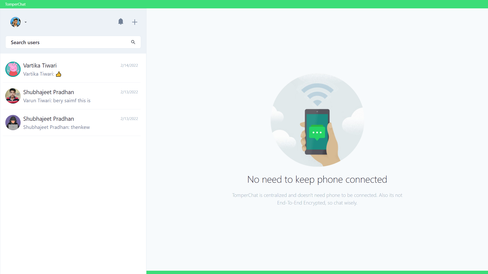

<p align='center'>

</p>
<p align='center'>
<b>WhatsApp clone build using MERN stack</b>
</p>
<p align='center'>
<a href='https://tomper-chat.onrender.com/' target='_blank'>tomper-chat.onrender.com</a> (cloud-based)
<br/>
<a href='https://tc.varuntiwari.com' target='_blank'>tc.varuntiwari.com</a> (self-hosted)
</p>

---

<p align='center'>
This is the frontend + backend of TomperChat build with MERN stack and hosted with <a href='https://www.render.com/' target='_blank'>Render</a>
</p>
<p align='center'>

<br>
<br>

</p>

#### 🧾 Description

TomperChat is a clone of WhatsApp. Its build using MERN stack and uses <a href='https://socket.io/'>socket.io</a> for realtime messaging, online statuses, typing indicators, notifications etc.

#### ✨ Features

- [x] User authentication.
- [x] Search for users to chat with.
- [x] Create a group-chat.
- [x] Only group-chat admin can edit the group chat details like name or add/remove users.
- [x] Uninterested users can leave the group-chat.
- [x] Chat in realtime with <a href='https://socket.io/'>socket.io</a>.
- [x] User's realtime online/offline status in private chat.
- [x] Users realtime typing indicator in both private and group chats.
- [x] Realtime chat notifications for both private and group chat.
- [x] Responsive for all screen sizes.
- [x] And most importantly 😎 Feels just like whatsapp-web (or Desktop app).

#### 🙄 TODO

- [ ] Users can delete messages.
- [ ] Group admins can delete group-chat.

#### ⚙ Tools and Technologies used

###### Frontend

1. [React.js](https://reactjs.org/)
2. [Chakra-ui](https://chakra-ui.com/)
3. [React-icons](https://react-icons.github.io/react-icons/)

###### Backend

1. [Node.js](https://nodejs.org/en/)
2. [Express.js](https://expressjs.com/)
3. [MongoDB](https://www.mongodb.com/)
4. [JWT](https://jwt.io/)
5. [Socket.io](https://socket.io/)
6. [Cloudinary](https://cloudinary.com/)
7. [Bcrypt.js](https://github.com/dcodeIO/bcrypt.js)

#### 🛠 Installation and setup

1. Clone the repo to your local machine.
2. Install the required dependency for server using :

   ```javascript
   npm install
   ```

3. Install the required dependency for client using :

   ```javascript
   cd client
   npm install
   ```

4. Create a .env file inside the root folder and provide the following environment variables:

   ```env
   PORT=5000
   DB_URI=<mongodb_uri>
   JWT_SECRET=<your_jwt_secret>
   JWT_EXPIRE=5d
   COOKIE_EXPIRE=5
   NODE_ENV=development
   CLOUDINARY_CLOUD_NAME=<your_cloudinary_cloudname>
   CLOUDINARY_API_KEY=<your_cloudinary_api_key>
   CLOUDINARY_API_SECRET=<your_cloudinary_api_secret>
   FRONTEND_URL=http://localhost:3000
   ```

5. Create a .env file inside the client folder and provide the following environment variables:

   ```env
   REACT_APP_PROJECT_URL=http://localhost:5000
   ```

6. Start the express server using :

   ```javascript
   npm start
   ```

7. Start the react development server using:

   ```javascrip
   cd client
   npm start
   ```

#### 🏎 Creating production built

1. Create a production build react app using the command :

   ```javascript
   cd client
   npm run build
   ```

2. Change the value of following environment variables:

   ```env
   NODE_ENV=production
   ```

<br>
<br>
<br>

<p align='center'>
(If you liked the project, give it star 😃)
</p>
